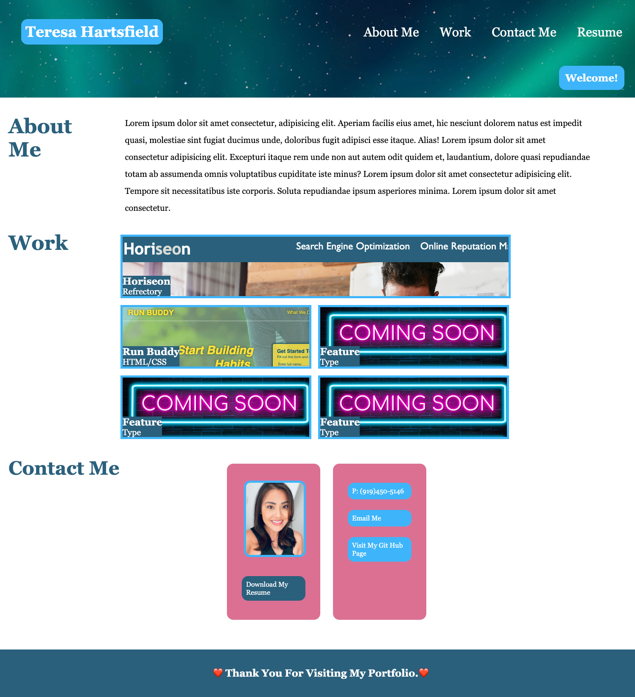

# Personal Portfolio

## Purpose

The purpose of this assignment is to create a personal portfolio utilizing skills learned with-in
the first two modules. In doing so, I have created a fully functional website from an empty shell
that mirrors the provided criteria and is responsive to various screen viewport's.

## Requirements

- Developers name, photo avatar, links to selected navagation pages and how to contact me.
- Created a UI list that scrolls to the coresponding section.
- First application feature that is larger than the subsequent projects.
- Linked projects to deployed application.
- Created a responsive layout that adapts to various screen viewports.

## Website

https://hartsfieldt.github.io/Tharts-collection/

## Git Hub

https://github.com/hartsfieldt/Tharts-collection

## Screencastify

https://drive.google.com/file/d/1aHPgEEbYBqIAnqPsRTv31WfgUvz7w-Ny/preview

## Contribution

Made with ❤️ by Teresa Hartsfield
